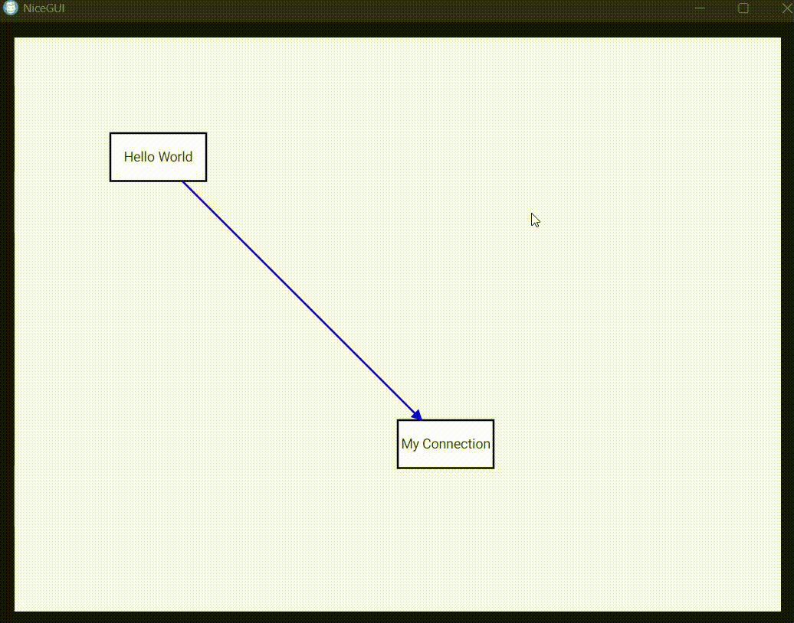

# JointJS[+] + Vue 3 + TypeScript + NiceGui + Python

This is an integration framework for [JointJS(Vue-ts)](https://github.com/clientIO/joint) graph UI on to [NiceGUI(python)](https://github.com/zauberzeug/nicegui), thus allowing us to build features and functions
natively on JointJS(+) and auto generate Vue-js files which can be easily integrated with NiceGUI framework.

## Quick Start

### Install all Vue3 project dependencies

`npm install`

### To test in Vue development environment

`npm run dev`

### To test in NiceGui

1. Convert the Vue3 TypeScript files to vue java script

   - for JointJs run `npm run convert-joint`
   - for JointJs+ run `npm run convert-joint+`

2. `cd tests`

3. set environment variable `USE_JOINT_PLUS`

   - for JointJS `USE_JOINT_PLUS=false`
   - for JointJS+ `USE_JOINT_PLUS=true`

4. `python hello.py`

_Note: modify JointJS library path @ `tests/hello.py:JOINT_JS_MODULE_PATH` as per your need_

